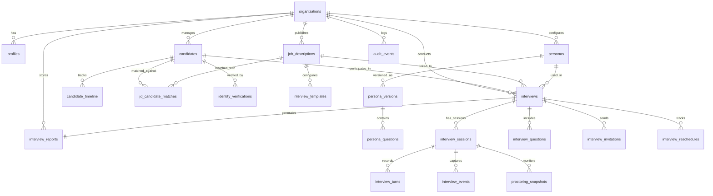

# Lokality AI — Database Schema Reference

> **Database Provider:** Supabase (PostgreSQL)  
> **ORM:** Prisma 6.x  
> **Schema File:** `backend/prisma/schema.prisma`  
> **Total Models:** 30  
> **Last Updated:** June 22, 2026

---

## Schema Overview Diagram

---

## Table Reference

### Core Business Tables

---

#### `organizations`

Multi-tenant organization container. All data is scoped by organization.

| Column | Type | Nullable | Default | Description |
|--------|------|----------|---------|-------------|
| `id` | UUID | No | `gen_random_uuid()` | Primary key |
| `name` | String | No | — | Organization name |
| `industry` | String | Yes | — | Industry sector |
| `size` | String | Yes | — | Company size category |
| `status` | String | Yes | `'active'` | Active/suspended status |
| `created_at` | TimestampTZ | No | `now()` | Creation timestamp |

---

#### `profiles`

User profiles linked to Supabase Auth. The `id` matches the Supabase auth user ID.

| Column | Type | Nullable | Default | Description |
|--------|------|----------|---------|-------------|
| `id` | UUID | No | — | Primary key (= Supabase auth.users.id) |
| `full_name` | String | Yes | — | Display name |
| `email` | String | Yes | — | Email address |
| `avatar_url` | String | Yes | — | Profile picture URL |
| `org_id` | UUID | Yes | — | FK → organizations.id |
| `title` | String | Yes | — | Job title |
| `created_at` | TimestampTZ | No | `now()` | Creation timestamp |
| `updated_at` | TimestampTZ | No | `now()` | Last update timestamp |

---

#### `user_roles`

RBAC role assignments per user.

| Column | Type | Nullable | Default | Description |
|--------|------|----------|---------|-------------|
| `id` | UUID | No | `gen_random_uuid()` | Primary key |
| `user_id` | UUID | No | — | FK → auth.users.id |
| `role` | AppRole | No | — | `admin`, `recruiter`, or `candidate` |

**Unique Constraint:** `(user_id, role)` — each user can only have one entry per role.

---

### Recruitment Tables

---

#### `candidates`

Candidate profiles managed by recruiters.

| Column | Type | Nullable | Default | Description |
|--------|------|----------|---------|-------------|
| `id` | UUID | No | `gen_random_uuid()` | Primary key |
| `org_id` | UUID | Yes | — | FK → organizations.id |
| `user_id` | UUID | Yes | — | FK → auth.users.id (if registered) |
| `created_by` | UUID | No | — | Recruiter who created this candidate |
| `full_name` | String | No | — | Candidate full name |
| `email` | String | No | — | Contact email |
| `phone` | String | Yes | — | Phone number |
| `role_applied` | String | Yes | — | Position applied for |
| `status` | String | No | `'new'` | Workflow status (see state machine) |
| `ai_score` | Decimal | Yes | — | AI-computed overall score |
| `resume_url` | String | Yes | — | Supabase Storage path |
| `resume_summary` | String | Yes | — | AI-generated resume summary |
| `skills` | String[] | No | — | Extracted skills array |
| `experience_years` | Decimal | Yes | — | Years of experience |
| `created_at` | TimestampTZ | No | `now()` | Creation timestamp |
| `updated_at` | TimestampTZ | No | `now()` | Last update timestamp |
| `deleted_at` | TimestampTZ | Yes | — | Soft delete timestamp |

**Candidate Status Values:**
`applied` → `resume_imported` → `resume_parsed` → `jd_matched` → `shortlisted` → `interview_assigned` → `interview_scheduled` → `invitation_sent` → `interview_started` → `interview_running` → `evaluation_processing` → `recruiter_review` → `hiring_decision` → `archived`

---

#### `candidate_timeline`

Chronological activity log for each candidate.

| Column | Type | Nullable | Default | Description |
|--------|------|----------|---------|-------------|
| `id` | UUID | No | `gen_random_uuid()` | Primary key |
| `candidate_id` | UUID | No | — | FK → candidates.id |
| `event_type` | String | No | — | Type of timeline event |
| `title` | String | No | — | Human-readable title |
| `description` | String | Yes | — | Event details |
| `meta` | JSON | Yes | — | Additional metadata |
| `created_at` | TimestampTZ | No | `now()` | Event timestamp |

---

#### `job_descriptions`

Job postings with AI-powered competency extraction.

| Column | Type | Nullable | Default | Description |
|--------|------|----------|---------|-------------|
| `id` | UUID | No | `gen_random_uuid()` | Primary key |
| `org_id` | UUID | Yes | — | FK → organizations.id |
| `created_by` | UUID | No | — | Creator user ID |
| `title` | String | No | — | Job title |
| `department` | String | Yes | — | Department |
| `location` | String | Yes | — | Location |
| `employment_type` | String | Yes | — | Full-time/Part-time/Contract |
| `description` | String | Yes | — | Full job description |
| `requirements` | String | Yes | — | Requirements (may be AI-generated) |
| `status` | String | No | `'draft'` | `draft`, `active`, `closed` |
| `competencies` | JSON | No | `'{}'` | AI-extracted competency map |
| `seniority` | String | Yes | — | Seniority level |
| `salary_min` | Decimal | Yes | — | Minimum salary |
| `salary_max` | Decimal | Yes | — | Maximum salary |
| `salary_currency` | String | Yes | — | Currency code |
| `persona_id` | UUID | Yes | — | FK → personas.id |
| `created_at` | TimestampTZ | No | `now()` | Creation timestamp |
| `updated_at` | TimestampTZ | No | `now()` | Last update timestamp |
| `deleted_at` | TimestampTZ | Yes | — | Soft delete timestamp |

---

#### `jd_candidate_matches`

AI-computed match scores between job descriptions and candidates.

| Column | Type | Nullable | Default | Description |
|--------|------|----------|---------|-------------|
| `id` | UUID | No | `gen_random_uuid()` | Primary key |
| `job_id` | UUID | No | — | FK → job_descriptions.id |
| `candidate_id` | UUID | No | — | FK → candidates.id |
| `match_score` | Decimal | No | — | AI match score (0-100) |
| `analysis` | JSON | No | `'{}'` | AI match analysis |
| `created_at` | TimestampTZ | No | `now()` | Timestamp |

---

### Interview Tables

---

#### `personas`

AI interviewer persona configurations.

| Column | Type | Nullable | Default | Description |
|--------|------|----------|---------|-------------|
| `id` | UUID | No | `gen_random_uuid()` | Primary key |
| `org_id` | UUID | Yes | — | FK → organizations.id |
| `created_by` | UUID | No | — | Creator |
| `name` | String | No | — | Persona name (e.g., "Technical Ava") |
| `persona_type` | String | No | `'technical'` | Type classification |
| `tone` | String | Yes | — | Communication tone |
| `difficulty` | String | Yes | — | Difficulty level |
| `prompt` | String | Yes | — | System prompt for AI |
| `config` | JSON | No | `'{}'` | Additional configuration |
| `created_at` | TimestampTZ | No | `now()` | Creation timestamp |
| `updated_at` | TimestampTZ | No | `now()` | Last update timestamp |

---

#### `interviews`

Core interview scheduling and tracking.

| Column | Type | Nullable | Default | Description |
|--------|------|----------|---------|-------------|
| `id` | UUID | No | `gen_random_uuid()` | Primary key |
| `org_id` | UUID | Yes | — | FK → organizations.id |
| `created_by` | UUID | No | — | Scheduling recruiter |
| `candidate_id` | UUID | No | — | FK → candidates.id |
| `job_id` | UUID | Yes | — | FK → job_descriptions.id |
| `persona_id` | UUID | Yes | — | FK → personas.id |
| `persona_version_id` | UUID | Yes | — | FK → persona_versions.id |
| `scheduled_at` | TimestampTZ | Yes | — | Scheduled date/time |
| `duration_minutes` | Int | Yes | `45` | Interview duration |
| `status` | String | No | `'scheduled'` | `scheduled`, `in_progress`, `evaluation_pending`, `completed`, `failed` |
| `transcript` | JSON | No | `'[]'` | Full conversation transcript |
| `evaluation` | JSON | No | `'{}'` | AI evaluation result |
| `overall_score` | Decimal | Yes | — | Final composite score |
| `recommendation` | String | Yes | — | `hire`, `strong_hire`, `no_hire` |
| `integrity_score` | Decimal | Yes | — | Proctoring integrity score |
| `evaluation_status` | String | No | `'pending'` | `pending`, `queued`, `running`, `done`, `failed` |
| `recruiter_id` | UUID | Yes | — | Assigned recruiter |
| `template_id` | UUID | Yes | — | FK → interview_templates.id |

---

#### `interview_sessions`

Active interview session tracking.

| Column | Type | Nullable | Default | Description |
|--------|------|----------|---------|-------------|
| `id` | UUID | No | `gen_random_uuid()` | Primary key |
| `interview_id` | UUID | No | — | FK → interviews.id |
| `org_id` | UUID | No | — | FK → organizations.id |
| `started_at` | TimestampTZ | No | `now()` | Session start time |
| `ended_at` | TimestampTZ | Yes | — | Session end time |
| `device_info` | JSON | No | `'{}'` | Browser/device metadata |
| `network_quality` | JSON | No | `'{}'` | Network quality metrics |

---

#### `interview_turns`

Individual conversation turns (question/answer pairs).

| Column | Type | Nullable | Default | Description |
|--------|------|----------|---------|-------------|
| `id` | UUID | No | `gen_random_uuid()` | Primary key |
| `session_id` | UUID | No | — | FK → interview_sessions.id |
| `speaker` | String | No | — | `candidate`, `persona`, `system` |
| `text` | String | No | — | Spoken/typed text content |
| `audio_path` | String | Yes | — | Audio recording storage path |
| `started_at` | TimestampTZ | No | — | Turn start time |
| `ended_at` | TimestampTZ | Yes | — | Turn end time |
| `turn_score` | JSON | Yes | — | Per-turn AI scoring |
| `created_at` | TimestampTZ | No | `now()` | Record timestamp |

---

#### `interview_events`

Proctoring and integrity event log.

| Column | Type | Nullable | Default | Description |
|--------|------|----------|---------|-------------|
| `id` | UUID | No | `gen_random_uuid()` | Primary key |
| `session_id` | UUID | No | — | FK → interview_sessions.id |
| `type` | String | No | — | Event type (see below) |
| `payload` | JSON | No | `'{}'` | Event-specific data |
| `at` | TimestampTZ | No | `now()` | Event timestamp |

**Event Types:** `tab_switch`, `devtools`, `focus_loss`, `multi_face`, `face_not_detected`, `clipboard_paste`, `screen_share_detected`

---

### Evaluation & Reporting Tables

---

#### `interview_reports`

AI-generated evaluation reports (one per interview).

| Column | Type | Nullable | Default | Description |
|--------|------|----------|---------|-------------|
| `id` | UUID | No | `gen_random_uuid()` | Primary key |
| `org_id` | UUID | No | — | FK → organizations.id |
| `interview_id` | UUID | No | — | FK → interviews.id (UNIQUE) |
| `executive_summary` | String | Yes | — | AI-generated markdown report |
| `scores` | JSON | No | `'{}'` | Competency scores breakdown |
| `strengths` | JSON | No | `'[]'` | Identified strengths |
| `weaknesses` | JSON | No | `'[]'` | Identified weaknesses |
| `knowledge_gaps` | JSON | No | `'[]'` | Knowledge gap areas |
| `integrity_score` | Decimal | Yes | — | Overall integrity assessment |
| `integrity_timeline` | JSON | No | `'[]'` | Integrity event timeline |
| `evidence` | JSON | No | `'[]'` | Supporting evidence clips |
| `recommendation` | String | Yes | — | `hire`, `strong_hire`, `no_hire` |

---

### Operations Tables

---

#### `ai_jobs`

Background AI task queue (evaluation, parsing, matching).

| Column | Type | Nullable | Default | Description |
|--------|------|----------|---------|-------------|
| `id` | UUID | No | `gen_random_uuid()` | Primary key |
| `org_id` | UUID | No | — | FK → organizations.id |
| `kind` | String | No | — | Job type (`evaluation`, `parse_resume`, `jd_match`) |
| `entity_type` | String | No | — | Related entity type |
| `entity_id` | UUID | No | — | Related entity ID |
| `status` | String | No | `'pending'` | `pending`, `running`, `completed`, `failed` |
| `attempts` | Int | No | `0` | Retry count |
| `last_error` | String | Yes | — | Last error message |
| `payload` | JSON | No | `'{}'` | Job-specific data |

---

#### `notification_outbox`

Transactional email delivery queue with outbox pattern.

| Column | Type | Nullable | Default | Description |
|--------|------|----------|---------|-------------|
| `id` | UUID | No | `gen_random_uuid()` | Primary key |
| `org_id` | UUID | No | — | FK → organizations.id |
| `kind` | String | No | — | Email type |
| `recipient_email` | String | No | — | Recipient email |
| `payload` | JSON | No | `'{}'` | Email template data |
| `status` | String | No | `'pending'` | `pending`, `sent`, `failed` |
| `error` | String | Yes | — | Error message if failed |
| `sent_at` | TimestampTZ | Yes | — | Delivery timestamp |

**Email Kinds:** `candidate_welcome`, `interview_invitation`, `interview_reminder`, `interview_report_ready`

---

#### `audit_events`

Compliance-grade audit trail for all significant actions.

| Column | Type | Nullable | Default | Description |
|--------|------|----------|---------|-------------|
| `id` | UUID | No | `gen_random_uuid()` | Primary key |
| `org_id` | UUID | No | — | FK → organizations.id |
| `actor_id` | UUID | Yes | — | User who performed the action |
| `entity_type` | String | No | — | Affected entity type |
| `entity_id` | UUID | No | — | Affected entity ID |
| `action` | String | No | — | Action performed |
| `diff` | JSON | Yes | — | Change diff (before/after) |
| `created_at` | TimestampTZ | No | `now()` | Event timestamp |

---

#### `gdpr_requests`

GDPR data access/deletion request tracking.

| Column | Type | Nullable | Default | Description |
|--------|------|----------|---------|-------------|
| `id` | UUID | No | `gen_random_uuid()` | Primary key |
| `org_id` | UUID | No | — | FK → organizations.id |
| `user_id` | UUID | No | — | Subject user ID |
| `request_type` | String | No | — | `export` or `delete` |
| `status` | String | No | `'pending'` | `pending`, `processing`, `completed` |
| `completed_at` | TimestampTZ | Yes | — | Completion timestamp |

---

### Configuration Tables

---

#### `interview_templates`

Reusable interview configuration templates.

| Column | Type | Nullable | Default | Description |
|--------|------|----------|---------|-------------|
| `id` | UUID | No | `gen_random_uuid()` | Primary key |
| `name` | String | No | — | Template name |
| `org_id` | UUID | No | — | FK → organizations.id |
| `job_id` | UUID | Yes | — | FK → job_descriptions.id |
| `persona_id` | UUID | Yes | — | FK → personas.id |
| `question_bank_ids` | UUID[] | No | — | Array of question IDs |
| `evaluation_criteria` | JSON | No | `'{}'` | Grading rubric |
| `duration_minutes` | Int | No | `45` | Default duration |
| `difficulty` | String | No | `'medium'` | Difficulty level |
| `proctoring_policy` | JSON | No | `'{}'` | Proctoring rules |
| `report_template` | JSON | No | `'{}'` | Report format config |
| `notification_rules` | JSON | No | `'{}'` | Email trigger rules |
| `follow_up_strategy` | String | No | `'adaptive'` | AI follow-up mode |
| `language` | String | No | `'en'` | Interview language |

---

#### `workspace_settings`

Per-organization key-value settings store.

| Column | Type | Nullable | Default | Description |
|--------|------|----------|---------|-------------|
| `id` | UUID | No | `gen_random_uuid()` | Primary key |
| `org_id` | UUID | No | — | FK → organizations.id |
| `key` | String | No | — | Setting key |
| `value` | JSON | No | — | Setting value |

**Unique Constraint:** `(org_id, key)`

---

#### `prompt_library`

AI prompt template management.

| Column | Type | Nullable | Default | Description |
|--------|------|----------|---------|-------------|
| `id` | UUID | No | `gen_random_uuid()` | Primary key |
| `name` | String | No | — | Unique prompt name |
| `prompt_type` | String | No | — | Prompt category |
| `prompt_text` | String | No | — | Full prompt text |

**Unique Constraint:** `name`

**Default Prompts:** `RESUME_PARSE_AGENT`, `JD_MATCHING_AGENT`, `EVALUATION_AGENT`, `REPORT_AGENT`
